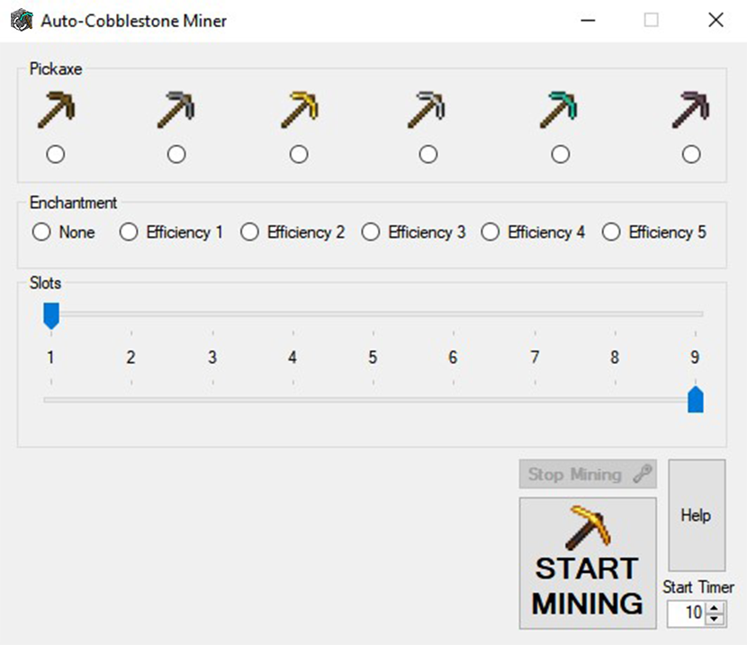
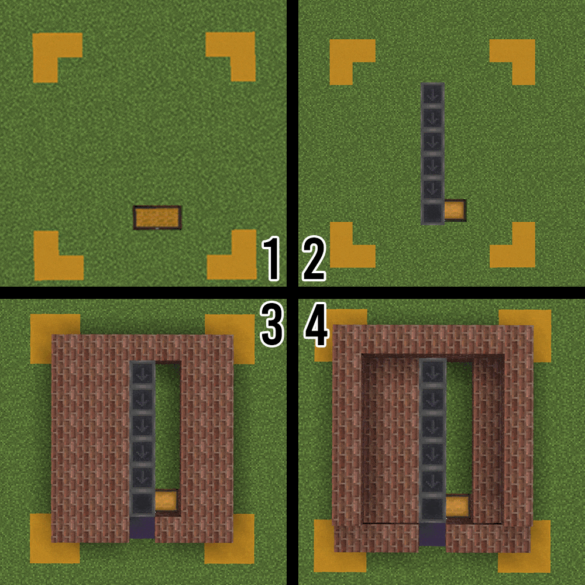
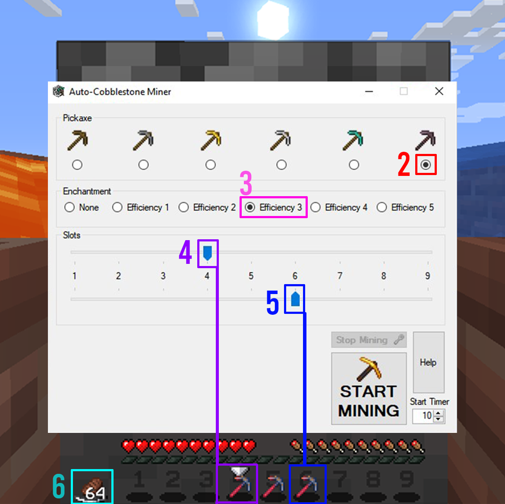
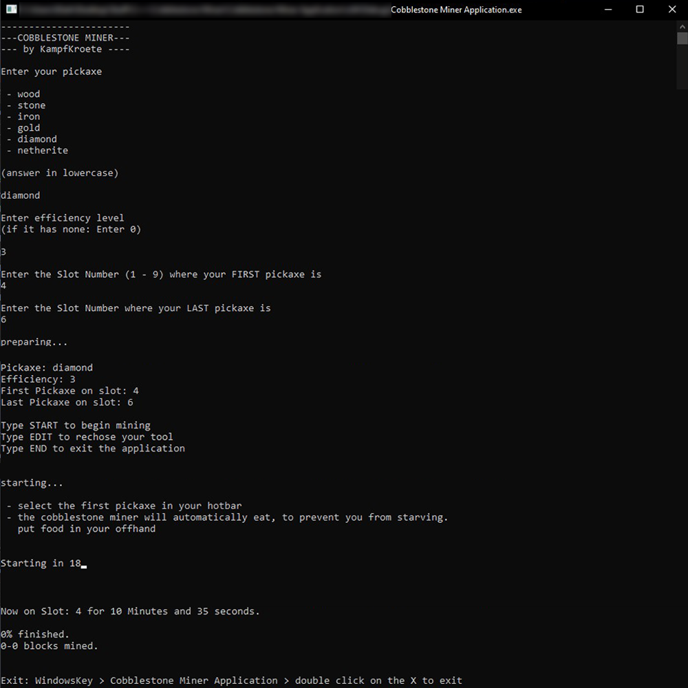

# AutoCobblestone Miner for Minecraft
 

***Tool, made to farm cobblestone while AFKing***

**Features:** 
- stops mining at low pickaxe durability
- swaps through pickaxes in hotbar
- automatic eating
- support for all pickaxe & efficiency level

**How to Use:**

1. Place yourself in front of an Inline Cobblestone Generator like this one:

*buckets symbolize lava/water source blocks*

2. select pickaxe
3. select efficiency level
4. select Hotbarslot with first pickaxe
5. select slot with last pickaxe
6. put food in offhand
7. press "START MINING" and go back in game

**example:**

*Netherite Pickaxe with efficiency 3, from Slot 4 to Slot 6 and some food in the offhand*

**If you want to manually stop mining, tap out of the game and press "Stop Mining". (might take a double click to do so)**

There's also a console version available:

